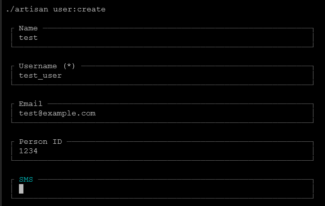

# Laravel user-cmd artisan commands
Laravel package which gives artisan **user** commands to administer users via console.
- Support for **spatie/laravel-permission**. 
- Support for own fields in User table. 


## Available commands

### php artisan user:list {id?} {--all} {--json} {--raw} {--sep=\n}
List users as a table or json.
- List all users -or- if {id} is defined list a single user. Listing a single 
user shows the data as key/value table.
- --all shows all values. Normally a smaller range of values are shown so
that the table rows don't wrap. With --all a wider range of values can be shown. 
See configuration and 'exclude-list'.
- --json will output the data in json format.
- --raw shows the raw values. Normally the values are taken from configuration.   
See configuration for type 'select' for more information.
- If package spatie/laravel-permission is installed you can also list permissions.
Default separator for listing permissions is '\n' (newline).
This can be changed to anything with --sep.
For example with json a better option would be comma (--sep=,).

### php artisan user:create
Interactively create an user.



### php artisan user:edit {id?}
Interactively edit an user.
User can be given with id number -or- if left out, 
it will list users where you can select the one to edit.

### php artisan user:remove {id?}
Remove user. User can be given with id number -or- if left out, it will list users
where you can select the one to remove.


## Install from local repository

Change to the base laravel folder (where the artisan command is located).
```
cd laravel
```

Make a local folder for packages (or any folder you want packages to be stored at).
```
mkdir -p packages
```

Clone the repo to the packages folder.
```
git clone https://github.com/KajPe/laravel-user-cmd packages/laravel-user-cmd
```

Configure composer to use the local packages folder.
```
composer config repositories.local path $(pwd)/packages/laravel-user-cmd
```

You can see this config also in the composer.json file.
The url depends on what the Laravel folder is.
```
"repositories": {
    "local": {
        "type": "path",
        "url": "/var/www/html/laravel/packages/laravel-user-cmd"
    }
}
```

Install the user-cmd package
```
composer require kajpe/user-cmd:@dev
```
Note that this will not technically install the files to the vendor folder, because we
are making a development installation. It will make a link to the **packages/laravel-user-cmd** folder. So don't remove the
packages folder and it's content.


## Configuration
By default, the Laravel 12 User fields are supported with no configuration required.
If you want to use spatie/laravel-permission or configure own fields you must publish the
config file.

```
php artisan vendor:publish 
  --provider="KajPe\\UserCmd\\UserCmdServiceProvider" --tag=config
```

The file will appear in the config directory named as **cmd-user.php**. The file
is a normal Laravel based config file.

The **id** defines what the unique field is. This will simply put a mark (*) in the 
header or prompt, it has no other meaning.

```
'id' => 'email'
```

This **fields** will list the available keys which corresponds to the User model fields.
- **label** will identify the prompt question or the header text for the field.
- **type** can be: **undefined**, **text**, **password**, **select** or **spatie**.
- **exclude-list** defines it the value is excluded from showing up.
Default is false which means show. If set to true (for example for password) it will
never be shown. If it's an array of two values [ true, false ] it depends on the --all
option. If --all is not set then true is used (which means don't show). If --all
is set then false is used (which means show).

Also remember to add all keys defined here (excluding spatie) to the User model 
$fillable array to be mass-assignable. Also note than there can only be one spatie type defined.

```
'fields' => [
        'id' => [
            'label' => 'ID'
        ],
        'name' => [
            'type' => 'text',
            'label' => 'Name',
        ],
        'password' => [
            'label' => 'Password',
            'type' => 'password',
            'exclude-list' => true
        ],
        'created_at' => [
            'label' => 'Created',
            'exclude-list' => [ true, false ],
        ],
        'permissions' => [
            'label' => 'Permissions',
            'type' => 'spatie'
        ],
        auth' => [
            'type' => 'select',
            'label' => 'Authentication',
            'options' => [
                0 => 'Local',
                1 => 'LDAP',
                2 => 'OAuth
            ],
            'default' => 0
        ],
```

For the example above:  
- For **id** there is no type defined.  
Therefor it will only show up in the user:list with the header text ID.

- For **name** the type is text.  
It will show up in the user:list with the header text Name.
In the user:create and user:edit it will show a text prompt Name for the user to type.

- For **password** the type is password.  
'exclude-list' => true will prevent the password from showing up in the user:list.
For user:create and user:edit, it will show a password prompt to fill in.
With user:edit it will ask an extra question if it needs to be changed.

- For **created_at** the type is not defined.  
It won't show up in the user:create or user:edit prompt.  
Because exclude-list has a value of [ true, false ] it's behaviour depends on 
--all option. If --all is not set it will not be listed.
When --all is set if will be listed with the header text Created.  

- For **permissions** the type is spatie.  
This will show the permissions in the user:list.
Also during user:create and user:edit it will show a multiselect prompt to select
permissions to assign to the user.

- For **auth** the type is select.  
This will show a selection list with the values from options, with a default selected value. 
So in this example will show Local, LDAP and OAuth, with a default selected as Local.  
If the user selects LDAP then a key value of 1 is returned and stored.
The key can be numeric or string.  
When issuing a user:list it will make a conversion and show all stored keys as values.
If there is a need to show the key values use the --raw option.
